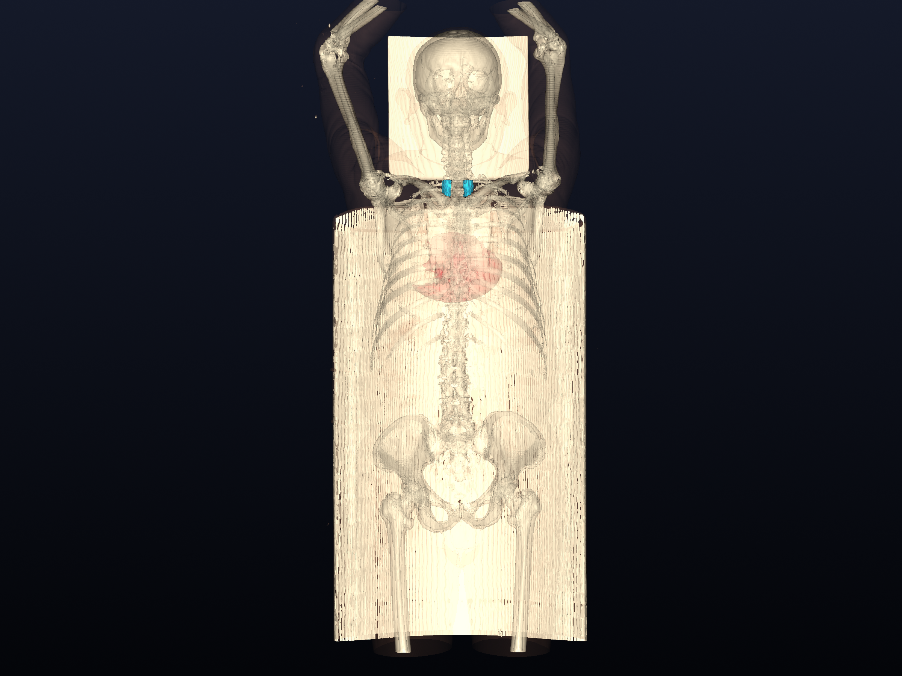
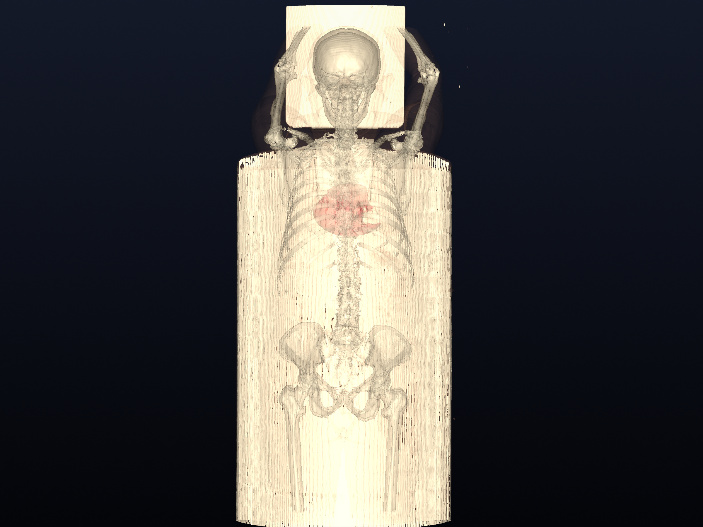
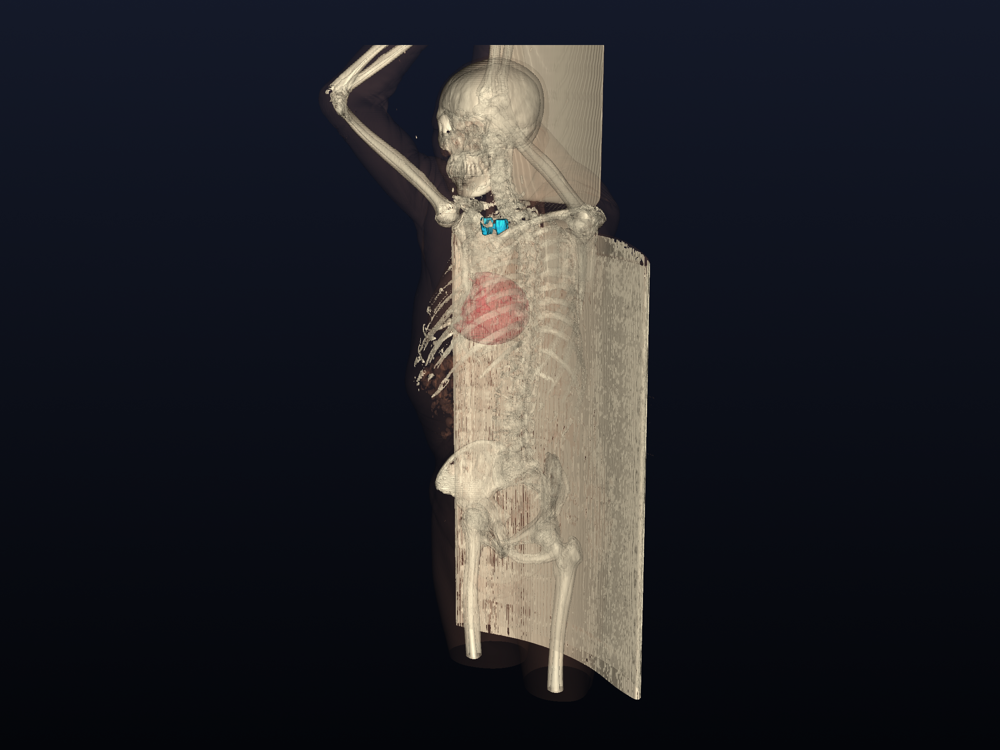
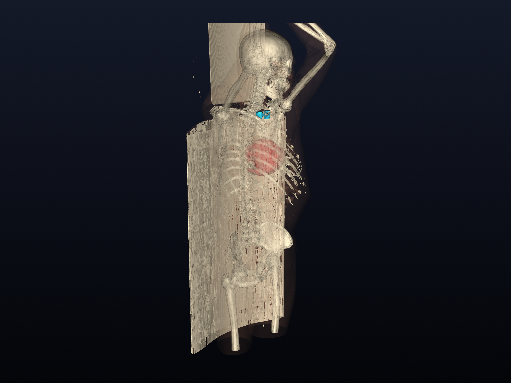
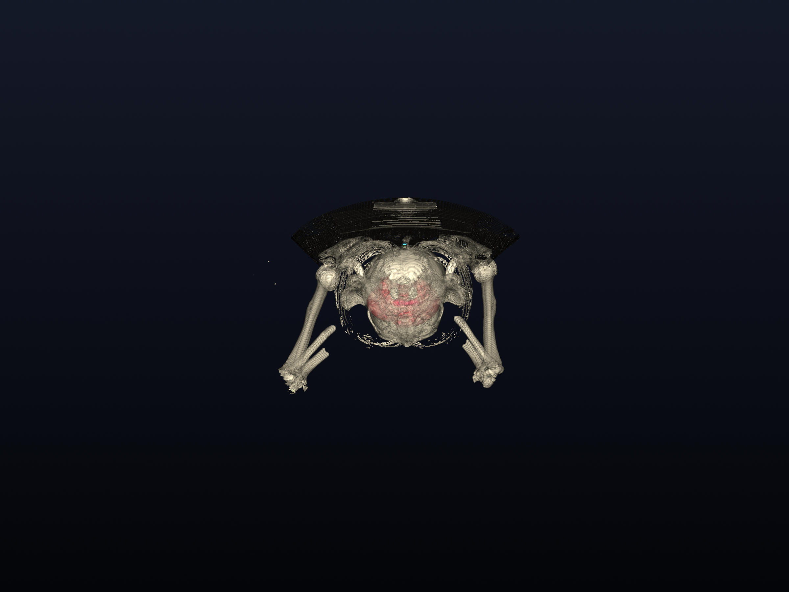

# PET/CT 3D Interactive Medical Visualization Suite

A high-performance 3D surface rendering and organ segmentation viewer framework for PET/CT medical DICOM datasets, built with Python and VTK.

> [!NOTE]
> **Data Privacy & Repository Notice**: This repository provides the complete **open-source viewing software framework, processing scripts, and visualization environment**. Raw patient DICOM datasets and extracted 3D mesh files (`organ_3d/`, `Data*/`, `.dcm`, `.vtp`) are strictly excluded via `.gitignore` for data privacy and lightness.

---

## 📸 8-Angle Multi-View 3D Visualization Gallery

### 1. Frontal View (Anterior Overview)


### 2. Posterior View (Back View)


### 3. Right Oblique 3D View


### 4. Left Oblique 3D View


### 5. Skeletal & Cardiovascular Reconstruction (Body Translucent/Hidden)


### 6. Thyroid & Cervical Spine Close-up (Frontal Detail)


### 7. Thyroid & Cervical Spine Close-up (Lateral Detail)


### 8. Superior View (Axial Top-Down Perspective)


---

## ✨ Framework Features

- **Interactive 3D VTK Engine**: Real-time trackball camera rotation, pan, zoom, and smooth specular lighting shaders.
- **Multi-Organ Layer Toggling**: Instantly show or hide specific anatomical structures using keyboard shortcuts.
- **Anatomical Segmentations Supported**:
  - 🦴 Skeletal System (Bone Surface Mesh)
  - 👤 Full Body Contour Surface
  - 🦋 Thyroid Gland (CT-derived approximation & PET candidates)
  - ❤️ Cardiac & Cardiovascular Structures (Heart, Coronary Candidates)
  - 🩺 Cervical Spine Detailed CT Mesh

---

## 🎮 Interactive Controls

### Mouse Navigation
- **Left Mouse Drag**: Rotate 3D Model
- **Right Mouse Drag**: Pan Camera
- **Mouse Wheel**: Zoom In / Zoom Out

### Keyboard Layer Controls
| Key | Layer Description |
| :---: | :--- |
| `1` | Toggle Full Body Surface Mesh |
| `2` | Toggle Bone / Skeletal Surface Mesh |
| `3` | Toggle PET/CT Thyroid Candidate Segmentation |
| `4` | Toggle CT-derived Thyroid Mesh |
| `5` | Toggle Cardiac / Heart Model |
| `6` | Toggle Coronary Calcium Candidate Mesh |
| `7` | Toggle Cervical Spine Mesh |
| `R` | Reset Camera View |
| `Q` / `ESC` | Exit Application |

---

## 🚀 Quick Start

### 1. Requirements
- Python 3.10+
- VTK (`pip install vtk`)
- PyDICOM (`pip install pydicom`)
- NumPy & Matplotlib

### 2. Running on Windows
Double-click [`start_3d_viewer.bat`](start_3d_viewer.bat) or run from terminal:
```bash
py interactive_3d_viewer.py
```

### 3. Generate Multi-Angle Screenshots
To automatically capture off-screen 3D renderings across all 8 angles:
```bash
py generate_github_screenshots.py
```

---

## 📁 Repository Structure

```text
petct-3d-viewer/
├── docs/
│   └── images/                     # Multi-angle 3D Screenshots for GitHub documentation
│       ├── 01_full_overview_front.png
│       ├── 02_full_overview_back.png
│       ├── 03_oblique_right.png
│       ├── 04_oblique_left.png
│       ├── 05_bone_and_cardiovascular.png
│       ├── 06_thyroid_neck_detail_front.png
│       ├── 07_thyroid_neck_detail_side.png
│       └── 08_superior_top_down.png
├── interactive_3d_viewer.py        # Primary interactive VTK 3D viewer framework
├── generate_github_screenshots.py  # 8-angle off-screen screenshot generator
├── analyze_thyroid_petct.py       # PET/CT quantitative thyroid analysis
├── segment_thyroid_from_ct.py     # CT thyroid segmentation pipeline
├── segment_heart_coronary.py      # Cardiac segmentation pipeline
├── segment_cervical_spine.py      # Cervical spine segmentation pipeline
├── start_3d_viewer.bat            # Windows 1-click launcher
└── .gitignore                      # Excludes raw DICOM and 3D data files
```

---

## ⚖️ License & Medical Disclaimer
*Note: This framework is intended for 3D visualization research and educational software development.*
